d

> **Documento** **de** **Definição** **de** **Processo** **(PDD)**
>
> **Cliente:** J M
>
> **Processos:**
>
> **1** **=** **\>** Reparcelamento de Contratos dentro do Sistema
> Sienge
>
> **2** **=** **\>** Emissão de Boletos
>
> **Analista** **Responsável:** Patricia Sena
>
> **Data** **da** **última** **atualização:** 12/03/2025
>
> **Histórico** **do** **Documento**

||
||
||
||
||

> **Aprovação** **do** **Documento**

||
||
||
||

1

> **Cliente:** J M
>
> **Processo:** Reparcelamento de Contratos dentro do Sistema Sienge e
> Emissão de Boletos
>
> **Donas** **do** **Processo:** Marcely e Tatiane
>
> **Analista** **Responsável**: Patricia Sena
>
> **Data** **da** **última** **atualização:** 16/04/2025
>
> **Ao** **validar** **este** **documento** **os** **envolvidos**
> **declaram** **estar** **cientes** **de** **que:** Estando validado o
> PDD, qualquer mudança na estrutura do processo mapeado ou alteração em
> telas (sejam estas do posicionamento de conteúdos, layout ou mesmo
> mudança de informações ou cores) resultará na necessidade de ajustes
> ao documento e retrabalhos na etapa de codificação, o que refletirá na
> alteração do cronograma, e na necessidade de contratação de horas
> complementares para a conclusão do projeto.
>
> Etapas não demonstradas, não listadas neste documento e
> consequentemente não validadas em PDD não integram o escopo e a
> execução do robô e portanto não serão desenvolvidas.
>
> **Documento** **de** **Definição** **de** **Processo** **(PDD)**
>
> **1.** **Objetivo**
>
> O presente Plano de Desenvolvimento Detalhado (PDD) visa documentar e
> otimizar o processo de Reparcelamento de Contratos dentro do Sistema
> Sienge e Emissão de Boletos, garantindo a padronização do fluxo de
> trabalho, a precisão nas informações e a eficiência operacional.
>
> **1.1** **-** **Objetivo** **do** **Documento** **de** **Definição**
> **de** **Processo**
>
> O objetivo deste documento é servir como guia para o desenvolvimento,
> garantindo o pleno entendimento das etapas e do fluxo do processo e
> consequentemente a efetividade da automação.

2

> **2.** **Acessos** **e** **Recursos** **Necessários**
>
> Portal IBGE Verificação de última atualização do IPCA. Portal FGV -
> Verificação de última atualização do IGPM.
>
> Planilhas Planilha
>
> atualizações de:
>
> BASE DE CÁLCULO REPARCELAMENTO 2025.xlsx

Base de apoio , editada pelo analista financeiro JM e onde serão
inseridas as

> Novos contratos
>
> Consulta mensal de pendência de IPTU ERP Sienge - Link *<u>Sienge</u>*
>
> Conta bancária Sicredi - Link <u>Sicredi</u>
>
> Conta de e-mail <u>login do e-mail -</u> <u>robo@rorato.adm.br</u>
>
> **3.** **Escopo**
>
> O escopo do projeto consiste na automação do processo de
> reparcelamento de contratos dos empreendimentos negociados pelas
> unidades indicadas abaixo:

||
||
||
||
||
||
||
||
||
||
||
||
||
||
||
||
||
||

3

> O processo abrange desde a validação dos índices de indexação IPCA e
> IGP-M nos portais do IBGE e da FGV, até a emissão dos boletos
> atualizados de cada empresa no banco Sicredi.
>
> O processo segue com a verificação de planilha de apoio, cópia de
> informações de novos contratos e Consulta IPTU e replicação dos dados
> extraídos na planilha de cálculo de reparcelamentos.
>
> Na sequência é feita a validação e atualização dos dados de cada
> contrato através de relatório do sistema de onde são extraídas
> informações inseridas na planilha calculo do reparcelamento, é então
> realizado o lançamento dos parcelamentos em sistema , onde são gerados
> os carnês de reparcelamento que são importados para o banco Sicredi
> para emissão final dos boletos e conclusão do processo
>
> **4.** **Equipe** **Envolvida**
>
> Sponsor: Marcely.
>
> ❖ *Responsabilidades:* Participar de acompanhamento semanal (etapa de
> desenvolvimento) e garantir a colaboração dos envolvidos e o repasse
> de todos os acessos e recursos necessários para o desenvolvimento da
> automação
>
> Donas do Processo: Marcely e Tatiane.
>
> ❖ Detalhar passo a passo do processo, apresentar todos os sistemas
> utilizados.
>
> ❖ Contribuir com a disponibilização de senhas e acessos, bem como com
> as configurações de sistemas e informações que sejam pertinentes ao
> processo.
>
> **5.** **Indicação** **de** **Melhorias** **no** **Processo**
>
> Unificação dos dados na planilha BASE DE CÁLCULO REPARCELAMENTO
> 2025.xlsx a ser utilizada pelo robô para execução dos cálculos de
> reajuste e que servirá de referência dos lançamentos em sistema.
>
> Disponibilização de planilha Base de apoio , atualizada pela JM com
> informações de inclusão de novos contratos para reparcelamento e
> consulta de IPTU
>
> Definição de aplicação Tipo de juros com a opção Nenhum.

4

> **6.** **Descrição** **Detalhada** **do** **Processo**
>
> **6.1** **Recorrência** **de** **execução.**
>
> A execução do processo ocorre mensalmente com duas etapas de execução.
>
> 1° Etapa ocorre no 11° dia do mês
>
> Abrange desde verificação dos índices até o envio de cópia da planilha
> base de cálculo para validação.
>
> 2° etapa Ocorre até o 16º dia do mês
>
> Abrange desde a leitura do e-mail de retorno do analista financeiro
> com ok para lançamentos em sistema, até a conclusão da emissão dos
> boletos no banco para todas as empresas
>
> Todos os processos executados no mês vigente tem como data base do
> reparcelamento o mês seguinte.
>
> Ex: Em março são realizados os cálculos dos reparcelamentos data base
> abril
>
> **6.2** **<u>FLUXOGRAMA</u>**
>
> O processo inicia-se com a validação dos índices mensais do IPCA e
> IGP-M nos portais do IBGE e da FGV respectivamente. Estes índices são
> listados na planilha de reparcelamento cada qual em sua aba
> específica, sendo aplicados como indexador no reparcelamento conforme
> indicação de indexador em coluna “**índice”** da aba Base de cálculo
> da planilha BASE DE CÁLCULO REPARCELAMENTO 2025.xlsx .
>
> **7** **.** **Consulta** **de** **índices** **atualizados.**
>
> **7.1** **Índice** **IPCA**
>
> IPCA - <u>https://www.ibge.gov.br/explica/inflacao.php</u>
>
> O IPCA é calculado pelo IBGE mensalmente, e refere-se ao mês anterior,
> o valor divulgado entre os dias 08 ao 11 de cada mês, por isso a
> execução do robô tem início no 11º dia de cada mês.

5

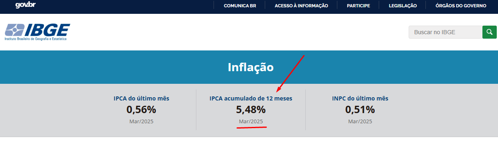

> Realizar o acesso a página para extrair a publicação do índice
> atualizado Verificar se foi realizada a publicação do índice referente
> ao mês anterior
>
> *Obs:* *em* *Abril* *o* *índice* *publicado* *será* *o* *de* *Março*
>
> Se o índice estiver disponível registrar no log o valor **“acumulado**
> **de** **12** **meses”**.
>
> Caso não conste a publicação realizar envio de log com a informação de
> indisponibilidade da publicação, e programar nova execução para o dia
> seguinte.
>
> O valor do índice “**IPCA** **acumulado** **de** **12** **meses”**
> será inserido na aba **IPCA** da planilha de cálculo de
> reparcelamento, na linha correspondente ao mês vigente.
>
> EX: Índice **Mar/2025** - na planilha será inserido na linha do mês de
> **Abril**
>
> **Obs:** O índice servirá de base para a correção dos contratos onde o
> IPCA é aplicado como indexador.
>
> Acessar a Planilha BASE DE CÁLCULO REPARCELAMENTO 2025.xlsx
>
> Acessar a aba IPCA

6

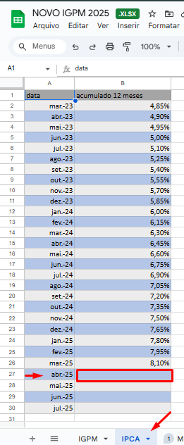

> Caso o índice não esteja disponível serão realizadas novas tentativas
> nos 3 próximos dias com envio de log em cada execução.
>
> **7.2.** **Índice** **IGPM**
>
> IGP-M **<u>https://portalibre.fgv.br/taxonomy/term/94</u>**
>
> O Índice é divulgado mensalmente pelo Instituto Brasileiro de Economia
> da Fundação Getulio Vargas (FGV IBRE), com publicação dentro das
> última semana do mês (Histórico de registros em 2025 giram dos dias 27
> a 30)
>
> O link **<u>https://portalibre.fgv.br/taxonomy/term/94</u>** mostrará
> as publicações mensais de atualização do índice IGPM

7

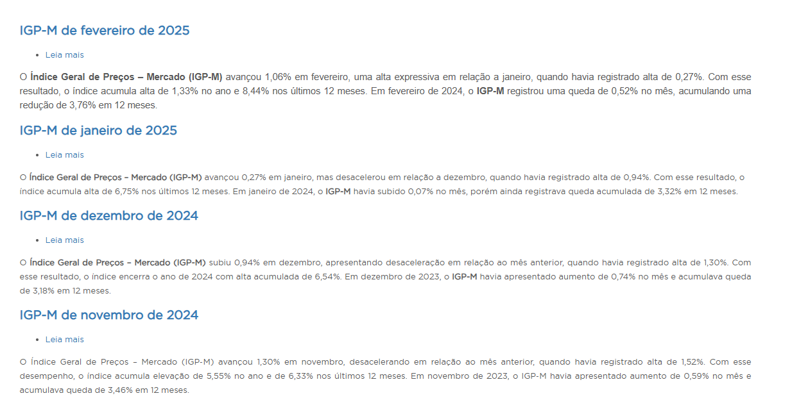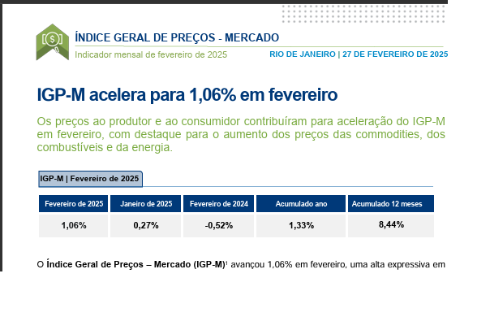

> Verificar disponibilização de publicação do índice para o mês vigente
>
> Estando disponível a publicação, acessar a nomeada como: IGP-M de
> ***março*** de ***2025*** Clicar em Ler mais
>
> Clicar para abrir o documento disponibilizado como PDF que será sempre
> o primeiro arquivo listado: IGP-M_FGV_press release\_**Fev**25.pdf
>
> Efetuar a leitura do arquivo
>
> Registrar no log do robô o índice do IGP-M acumulado de 12 meses.

8

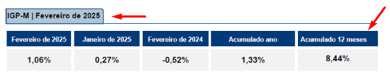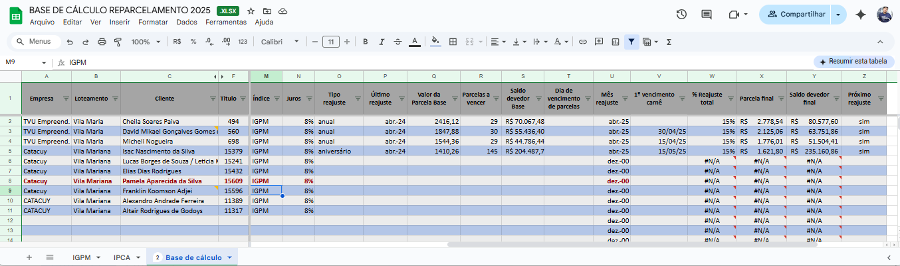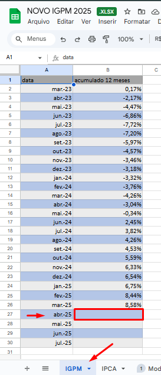

> O valor **“Acumulado** **12** **meses”** será inserido na aba
> “**IGPM”** da planilha base de cálculo de reparcelamento na linha do
> mês vigente.
>
> **Obs:** O Índice servirá de base para a correção dos contratos onde o
> IGP-M é aplicado como indexador.
>
> Acessar a Planilha BASE DE CÁLCULO REPARCELAMENTO 2025.xlsx
>
> Acessar a aba IGPM

9

> **Obs:** Se o Reajuste for superior ao teto de 15% não será
> considerado na fórmula do cálculo de reajuste das parcelas, a fórmula
> já está aplicada na planilha de cálculo e já considera a regra:
>
> Fórmula
>
> =SE(U2\<=DATAM(HOJE();1);SE(PROCV(DATAM(U2;-2);INDIRETO(\$M2&"!A2:B3000");2;FALSO)="";"";SE
> (\$M2="IGPM";MÍNIMO(15%;(1+MÁXIMO(0;PROCV(DATAM(U2;-2);INDIRETO(\$M2&"!A2:B3000");2;FA
> LSO)))\*(1+\$N2)-1);(1+MÁXIMO(0;PROCV(DATAM(U2;-2);INDIRETO(\$M2&"!A2:B3000");2;FALSO)))\*(1
> +\$N2)-1));"")
>
> ***Variação*** ***de*** ***nomenclaturas*** ***possíveis*** ***para***
> ***arquivo:***
>
> 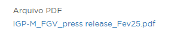 style="width:2.95833in;height:0.51042in" />IGP-M_FGV_press
> release_Fev25.pdf
>
> IGP-M_FGV_press release_Jan25.pdf
>
> 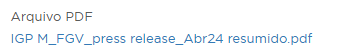 style="width:3.17708in;height:0.48958in" />IGP M_FGV_press
> release_Dez24 resumido.pdf
>
> IGP M_FGV_press release_Abr24 resumido.pdf
>
>  style="width:2.66667in;height:0.45833in" />IGP-M de março de 2024

10

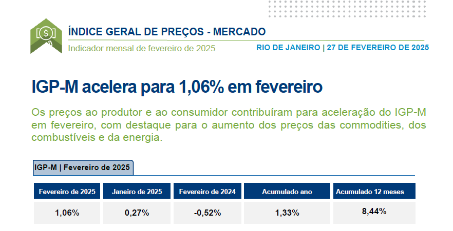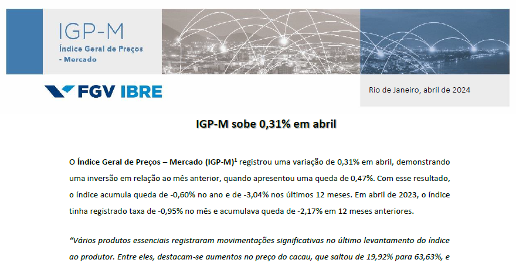

> ***Variação*** ***de*** ***layout*** ***possíveis*** ***para***
> ***arquivo***
>
> Atual - Modelos disponíveis de janeiro e fevereiro de 2025
>
> Abril

11

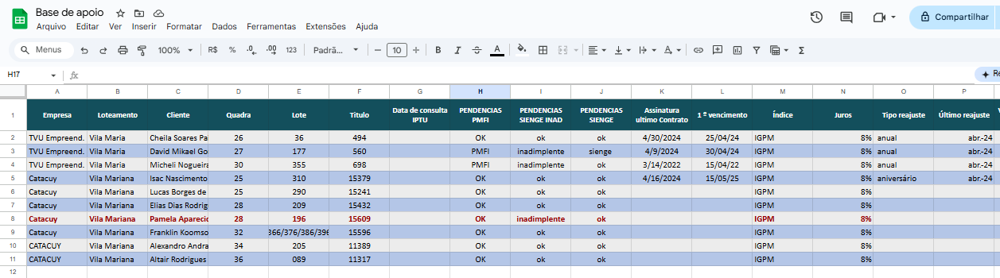

> **8.** **Verificação** **Base** **de** **apoio.**
>
> Em seguida a captação do índice e sua inclusão na planilha, o robô irá
> verificar na planilha base de apoio a existência de novos contratos a
> serem incluídos na base de cálculo de reparcelamento, e a atualização
> dos dados de consulta de IPTU.
>
> **8.** **1** **-** **Verificação** **de** **novos** **contratos**
>
> Acessar a planilha Base de apoio na aba **NOVOS** **CONTRATOS**,
> copiar as linhas onde constarem novo lançamentos, colar as linhas
> copiadas na aba **Base** **de** **cálculo** da planilha
>
> BASE DE CÁLCULO REPARCELAMENTO 2025.xlsx , em sequência aos contratos
> já existentes ali.
>
> Obs: A aba NOVOS CONTRATOS da planilha Base de apoio espelhará as
> mesmas colunas e informações da planilha utilizada pelo robô, e deverá
> ser preenchida pelo analista com a inclusão dos dados de novos
> contratos que entrarem para o reparcelamento.
>
> **8.** **2** **-** **Verificação** **de** **consulta** **de** **IPTU**
>
> Obs: A aba Consulta IPTU deverá ser preenchida pelo analista com as
> informações da consulta de IPTU de cada cliente listado na base de
> cálculo de reparcelamento sendo incluída a data em que a consulta foi
> realizada
>
> O robô irá acessar a aba Consulta IPTU
>
> Ele irá verificar para cada cliente/Título a atualização data consulta
> do IPTU
>
> Fará a cópia da informação da coluna IPTU PENDÊNCIAS PMFI para os
> Clientes/títulos cuja “Data de consulta” é do mês vigente
>
> Irá Acessar a planilha BASE DE CÁLCULO REPARCELAMENTO 2025.xlsx .

12

> 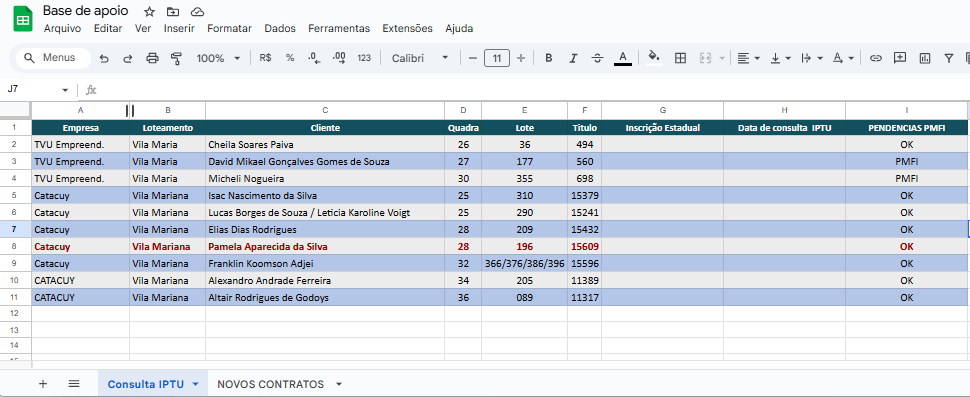 style="width:6.78125in;height:2.77083in" />Colar as informações
> copiadas na coluna de IPTU PENDÊNCIAS PMFI do cliente/título
> correspondente.
>
> Após atualizar a planilha BASE DE CÁLCULO REPARCELAMENTO 2025.xlsx ,
> com as informações disponíveis na Base de apoio o robô irá filtrar os
> títulos que devem ser reparcelados no mês considerando como referência
> a coluna "mês reajuste" e registrando no log aqueles títulos cujo
> reparcelamento deve ser realizado com base no mês seguinte.
>
> Caso IPTU de um contrato que deve ser atualizado não tenha consulta
> atualizada no mês registrar log Clientes/Títulos com informação
> pendente e enviar relatório com relação de pendências ao analista
> financeiro, estes nomes não serão listados.
>
> Copiar os nomes dos clientes / n° Título do contrato no log do robô
>
> Ao registrar no log as informações o robô fará a atualização da data
> na coluna "Último reajuste" informando o dia/mês da base de
> cálculo/ano .
>
> Fórmula de Coluna "mês reajuste" = DATA(ANO(P2)+1; MÊS(P2); 1)
>
> Com a relação de **“clientes/** **títulos** **a** **reparcelar”**
> registrados no log, o robô irá acessar Sienge para iniciar a consulta
> do relatório financeiro de cada contrato.

13

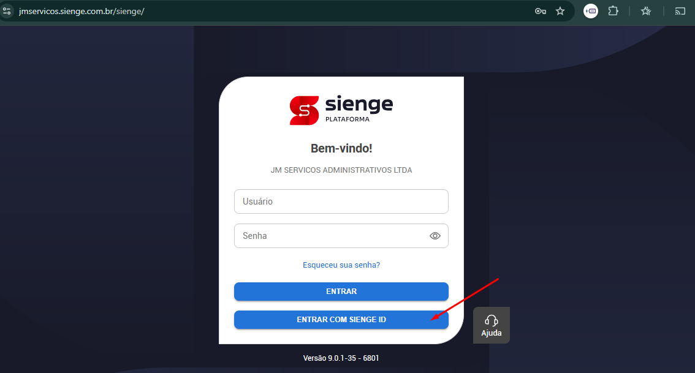

> **9** **Acesso** **ao** **ERP** **-** **Sienge**
>
> *Sistema* *Sienge* *<u>https://jmservicos.sienge.com.br/sienge/</u>*
> *Acesso* *-* *<u>tc@trajetoriaconsultoria.com.br</u>*
>
> *Senha* *-* *Disponível* *em* *planilha* *de* *acessos*
>
> Acessar a página do sistema -
> <u>https://jmservicos.sienge.com.br/sienge/</u> Clicar no botão entrar
> com ID Sienge
>
> Informar o usuário de acesso -
> <u>(tc@trajetoriaconsultoria.com.br)</u> e clicar no botão Continuar

14

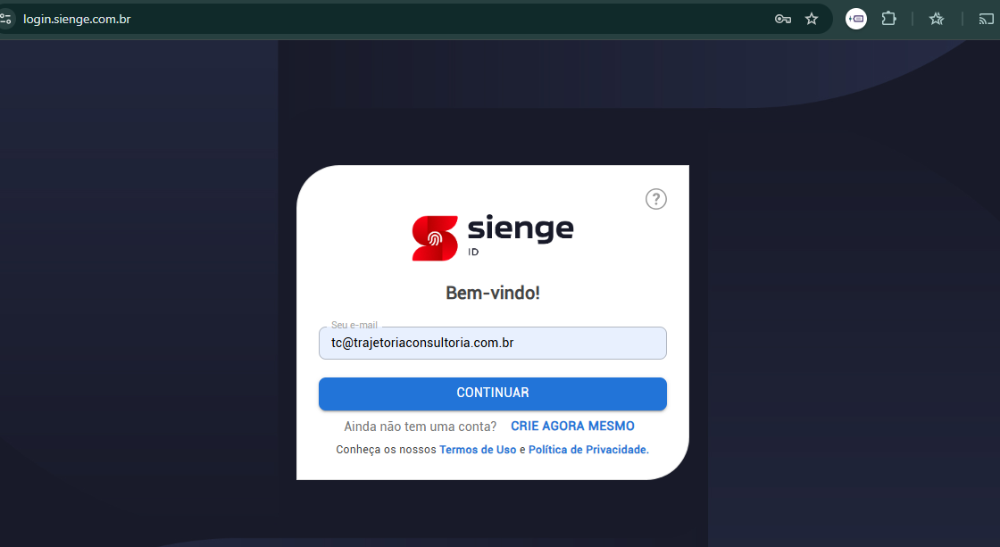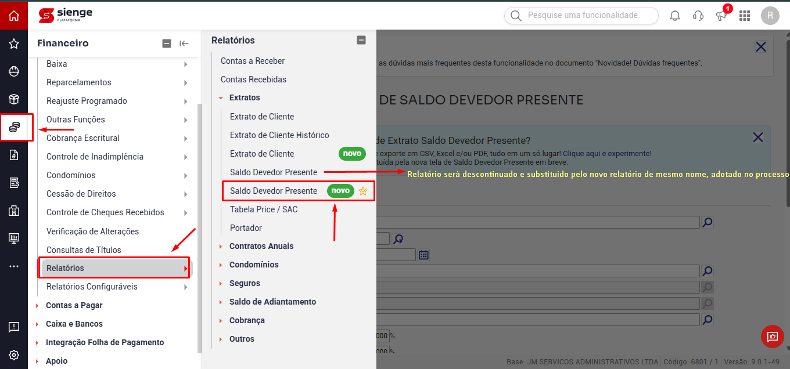

> Informar a Senha de acesso e clicar em entrar.
>
> Fechar caixas de mensagem que se abrirem na tela inicial para seguir
> com o processo.
>
> **9.1** **Acesso** **aos** **relatório** **Saldo** **devedor**
> **Presente** **-** **Sienge**
>
> Acessar o menu Financeiro Relatório
>
> Extrato
>
> Saldo devedor Presente

15

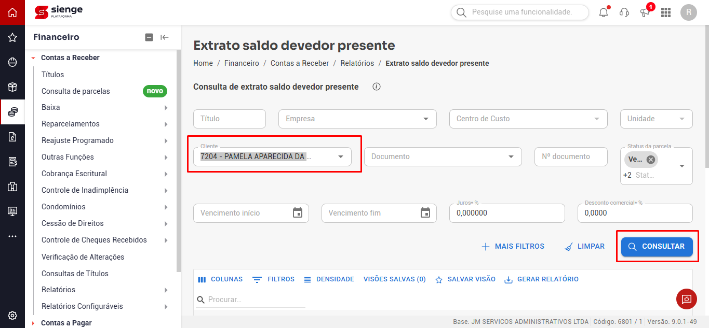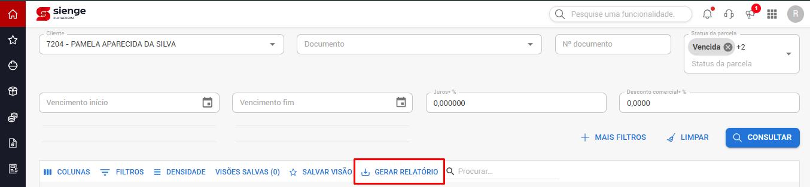

> Informar no campo nome do cliente no campo Cliente Clicar em Consultar
>
> Clicar em Gerar relatório
>
> Selecionar tipo de documento. Clicar em Exportar

16

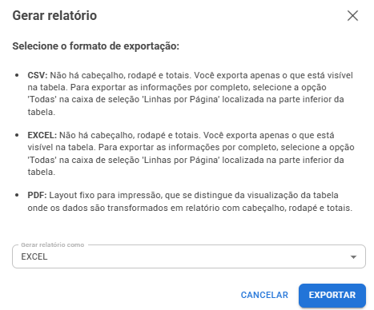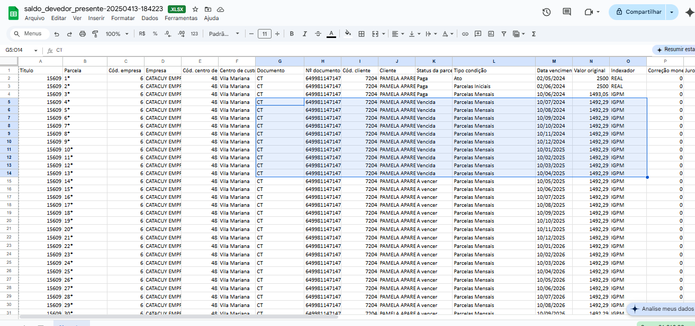

> Repetir o processo de pesquisa e baixa dos relatórios para cada
> cliente registrado no log **“clientes/** **títulos** **a**
> **reparcelar”**
>
> Ao final da lista compilar os todos os relatórios baixados em um único
> arquivo.
>
> **9.1.1** **Leitura** **e** **extração** **de** **dados** **do**
> **relatório**
>
> Para cada cliente listado no log **“clientes/** **títulos** **a**
> **reparcelar”** identifica as seguintes informações Dentro do
> relatório :
>
> ★ Dia de vencimento das parcelas
>
> (Filtrando por - Coluna “**Status** **da** **parcela”** *(Apenas* *a*
> *vencer)* - Identificar na Coluna “**Data** **vencimento”** o dia no
> mês em que a parcela vence (*EX:* *DIA* *10)*
>
> (validar informação em parcelas a partir do mês base do
> reparcelamento).

17

> Calcular o 1º vencimento do novo carnê considerando o dia informado e
> a regra de Tipo de reparcelamento.
>
> ➔ Para Tipo Reajuste **Anual** (a data base de correção é 12 meses
> após o primeiro vencimento de parcela, não considerando data de
> assinatura de contrato ou pagamento de entrada)
>
> Preencher "1 º vencimento carnê" para o mesmo mês de base do
> reparcelamento realizado Ex: reparcelamento será para parcelas a
> partir de maio e o vencimento da primeira parcela cairá em maio
> preencher =\> xx/maio/2025
>
> ➔ Para Tipo Reajuste **Aniversário** (a data base da correção é o dia
> do mês em que contrato foi assinado)
>
> Preenchimento do campo "1 º vencimento carnê":
>
> ● Caso o vencimento caia antes do aniversário ( dia do mês em que o
> contrato foi assinado) preencher o vencimento inicial com a data do
> mês seguinte.
>
> Ex: reparcelamento será para parcelas a partir de maio e o vencimento
> da primeira parcela será preenchido com xx/junho/2025
>
> ● Caso o vencimento caia após o aniversário manter a data do primeiro
> vencimento para o mesmo mês de base do reparcelamento
>
> Ex: reparcelamento será para parcelas a partir de maio e o vencimento
> da primeira parcela cairá em maio preencher =\> xx/maio/2025
>
> Registrar no log a data que será aplicada no campo 1º vencimento
> carnê, ela será utilizada ainda na consulta parado relatório e após
> consulta será informada na planilha base de cálculo .
>
> ★ Valor da parcela atual
>
> Para saber por qual coluna filtrar “**Valor** **original”** ou
> “**Valor** **Corrigido”,** conferir a coluna "**original** **ou**
> **corrigido"** da planilha de base de cálculo.
>
> (Filtrando por - Coluna “**Status** **da** **parcela”** *(a*
> *vencer)* - Identificar na Coluna “**Valor** **original”** o valor da
> parcela atual do cliente).
>
> (Filtrando por - Coluna “**Status** **da** **parcela”** *(a*
> *vencer)* - Identificar na Coluna “**Valor** **Corrigido”** o valor da
> parcela atual do cliente).
>
> (validar informação de parcelas a partir do mês base do
> reparcelamento).
>
> ★ Verificar existência de parcelas abertas com colunas “**Valor**
> **original”** diferente do valor de parcela atual e “**Tipo**
> **condição**” diferentes de “Parcela Mensal”

18

> (Filtrando por - Coluna “**Status** **da** **parcela”** *(a*
> *vencer)* - *“**Documento”*** *(CT)* -
>
> Havendo estas parcelas registrar no log para envio de relatório para
> verificação do analista financeiro ao final do processo.
>
> ★ Quantidade de parcelas a vencer
>
> (Filtrado por - Coluna “**Status** **da** **parcela”** **-** *(Apenas*
> *a* *vencer)* *e* *“**Documento”*** *(CT)* - contar o número de
> parcelas que estão em aberto
>
> Ex: 150 parcelas
>
> (validar informação de parcelas a partir do mês base do
> reparcelamento). Levar em consideração se a data de vencimento é após
> a data do aniversário do mês base, caso seja, será a parcela do mês
> seguinte ao mês da base do reparcelamento.
>
> \*Essa condição será usada somente para os contratos mês de
> Aniversário.\* Para anual será considerada a parcela com vencimento
> dentro do mês base da correção.
>
> ★ Quantidade de parcelas vencidas
>
> ( Filtrado por Colunas “**Documento”** *(CT)* / “**Status** **da**
> **parcela”** **-** *(vencida)* *-* contar as parcelas que estão
> vencidas
>
> ➢ Considerar aqui o valor obtido no cálculo do 1º vencimento da nova
> parcela.
>
> ➢ Caso sejam identificadas **parcelas** **em** **aberto** **com**
> **vencimento** **60** **dias** **antes** **da** **data** **1º**
> **vencimento** **do** **novo** **carnê** referentes a documento tipo
> CT será informada **Inadimplência** - na planilha de cálculo de
> reparcelamento na coluna **PENDÊNCIAS** **SIENGE** **INAD**
>
> Identificar a existência de outras pendências ( Filtrado por Colunas
> “**Documento”** *(REC* *ou* *FAT)* / “**Status** **da** **parcela”**
> **-** *(vencida)* *.*
>
> ➢ Caso seja identificada pendência em parcelas do tipo REC ou FAT -
> serão referentes a custas e honorários e serão informadas na planilha
> de cálculo de reparcelamento como **Pendências** **Sienge** na coluna
> **PENDÊNCIAS** **SIENGE**
>
> **9.1.2** **Atualização** **dos** **dados** **captados** **em**
> **planilha** **base** **de** **cálculo**
>
> Após verificação completa de relatórios compilados o robô irá
> atualizar as informações conforme indicado acima nas colunas
> correspondentes na aba **Base** **de** **cálculo** da planilha

19

> BASE DE CÁLCULO REPARCELAMENTO 2025.xlsx
>
> PENDÊNCIAS SIENGE INAD PENDÊNCIAS SIENGE Parcelas a vencer
>
> Valor da Parcela Base
>
> Dia de vencimento de parcelas 1º vencimento carnê
>
> Após atualizar as informações e concluir os cálculos, o robô enviará
> por e-mail para o analista financeiro uma cópia da planilha de
> cálculos de reparcelamento para que o mesmo possa fazer a validação do
> preenchimento e dos cálculos realizados antes do lançamento em
> sistema.
>
> O processo referente a primeira etapa estará concluído
>
> **Fórmulas** **da** **planilha** **de** **Case** **de** **cálculo**
>
> **mês** **reajuste:** **=**DATA(ANO(P2)+1; MÊS(P2); 1)
>
> **reajuste** **total:**
>
> =SE(V2\<=DATAM(HOJE();1);SE(PROCV(DATAM(V2;-2);INDIRETO(\$M2&"!A2:B3000");2;FALSO)="";"";SE(\$M2="IGPM";MÍNI
> MO(15%;(1+MÁXIMO(0;PROCV(DATAM(V2;-2);INDIRETO(\$M2&"!A2:B3000");2;FALSO)))\*(1+\$N2)-1);(1+MÁXIMO(0;PROC
> V(DATAM(V2;-2);INDIRETO(\$M2&"!A2:B3000");2;FALSO)))\*(1+\$N2)-1));"")
>
> **parcela** **final** =SE(OU(W2=""; Q2=""); ""; Q2+Q2\*W2)
>
> **saldo** **devedor** **final:** =SE(X5="";"";X5\*R5)
>
> **próximo** **reajuste** =SE('Base de
> cálculo'!\$R2="";"";SE(R2\>12;"sim";"não"))
>
> **10** **Retorno** **de** **validação**
>
> No 16º dia de cada mês, o robô irá acessar sua conta para verificar o
> retorno de e-mail do analista que deverá estar identificado com o
> Título - “**Lançamento** **de** **reparcelamentos** **autorizado**”
>
> Login no e-mail
>
> Acessar Tela de <u>login do e-mail</u>

20

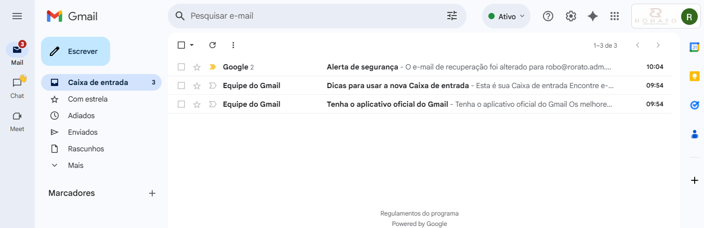

> Inserir o endereço - <u>robo@rorato.adm.br</u>
>
> Informar Senha - Disponível em planilha de senhas e acessos.
>
> Verificação de mensagem recebida com o título informado. Título -
> “**Lançamento** **de** **reparcelamentos** **autorizado**”
>
> Ao identificar o recebimento da mensagem na caixa de entrada robô irá
> iniciar a segunda etapa do processo .
>
> Variações dentro do processo
>
> Caso o e-mail não seja encontrado será enviado log informando a
> indisponibilidade da mensagem e nova tentativa de execução será
> programada para o dia seguinte
>
> Serão realizadas tentativas de retomada do processo por 5 dias.
>
> Não sendo autorizada a execução com o recebimento do e-mail, o robô
> enviará o log informando a necessidade de lançamento manual.
>
> **10.1** **Registro** **do** **reparcelamento** **no** **Sistema**
> **Sienge:**
>
> Logado no sistema acessar o menu Inserção do novo parcelamento com
> correção no sistema. Financeiro

21

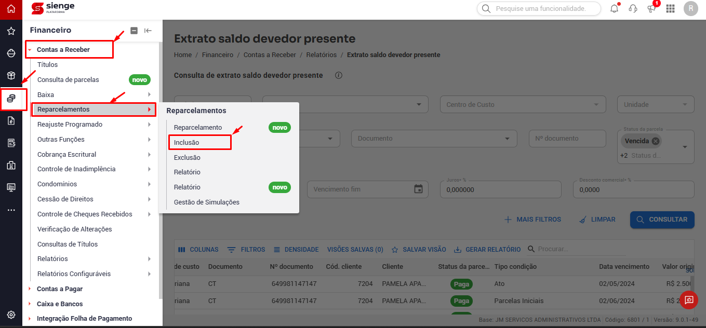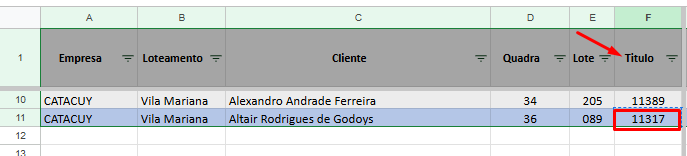

> Contas a receber. Reparcelamento.
>
> Inclusão.
>
> Preencher o Número do título em reparcelamento Clicar em Consultar

22

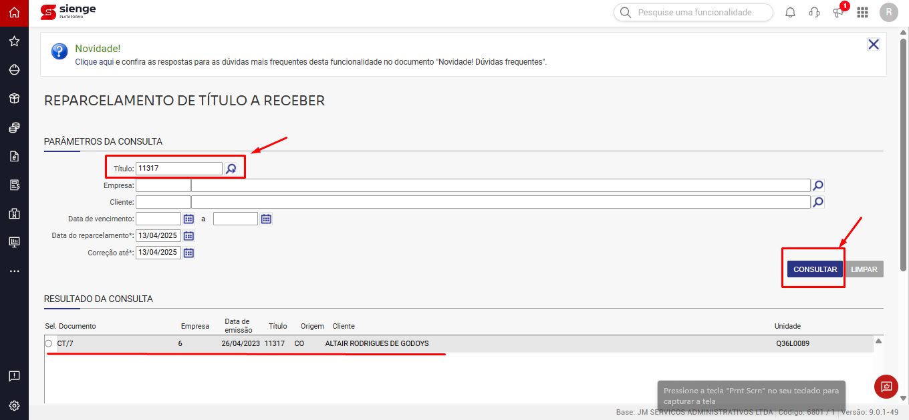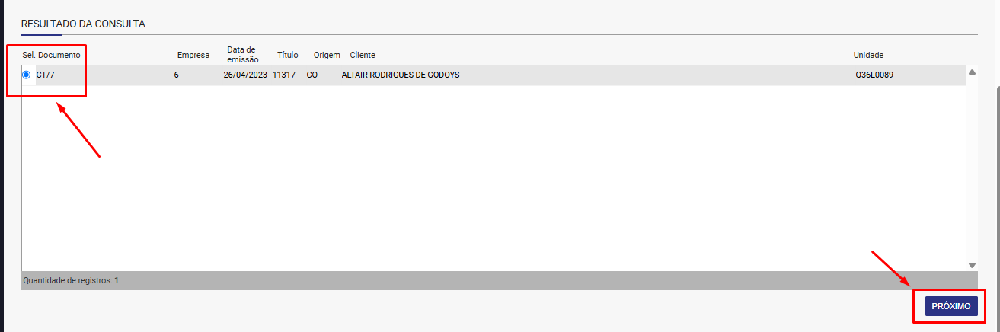

> Selecionar documentos e clicar no próximo.
>
> Aguardar o carregamento da tela
>
> Dar um Scroll para acessar o botão marcar todos no final da tela.

23

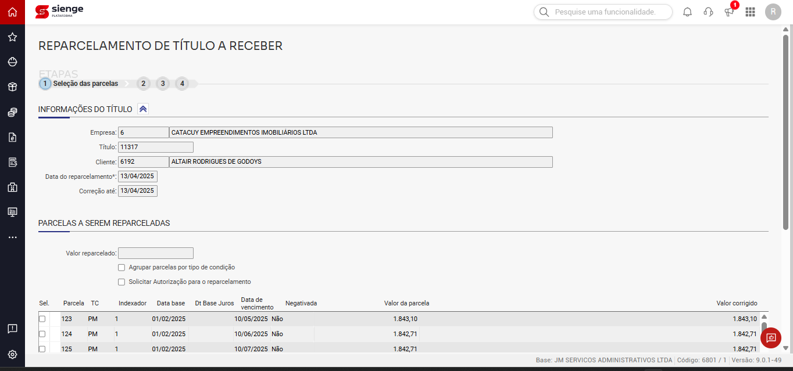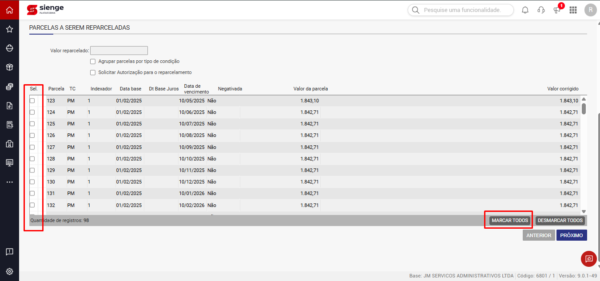

> Desmarcar parcelas cujo vencimento sejam iguais ou inferiores ao mês
> vigente estejam estas atrasadas ou não.
>
> Obs: Manter selecionados apenas as parcelas futuras com vencimento a
> partir do mês no qual o reajuste será aplicado.

24

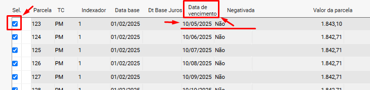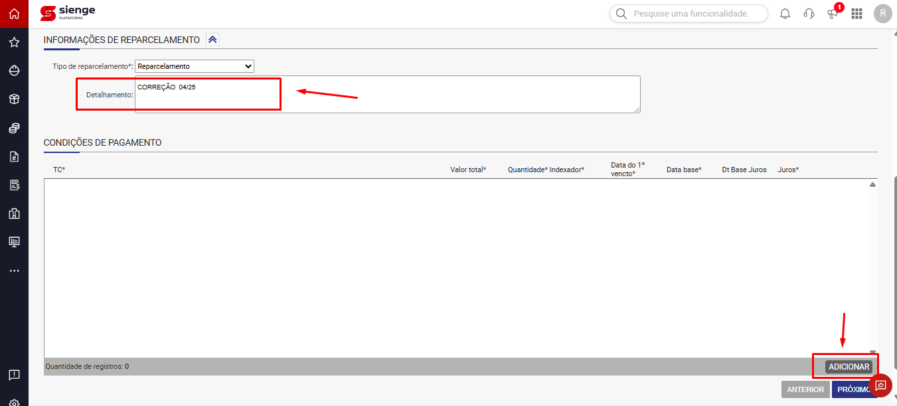

> Clicar em Próximo Dar um Scroll de tela
>
> No campo detalhamento informar - Correção e mês/ano da mesma = Ex:
> CORREÇÃO 04/25 Clicar em adicionar.
>
> Preencher as informações
>
> Replicar nos campos as informações da Planilha Tipo condição\*: PM
>
> Valor total\*: Preencher com saldo devedor NOVO Quantidade de
> parcelas\*: Número de parcelas pendentes
>
> Data do 1º vencto\*: Data de vencimento (a mesma data do vencimento
> indicada no relatório) Portador\*: 1 Carteira (Já vem preenchido, não
> alterar)
>
> Operação de cobrança\*: 0 Cobrança em Carteira (Já vem preenchido, não
> alterar) Indexador\*: - 1 IGP-M (Mesmo que na planilha conste IPCA no
> sistema é informado o IGP-M Data base\*: O sistema preenche
> automaticamente.

25

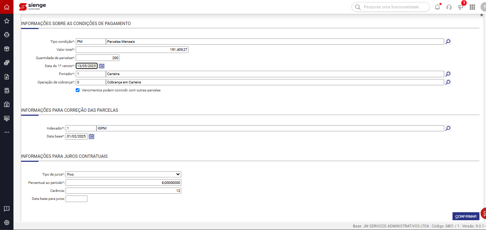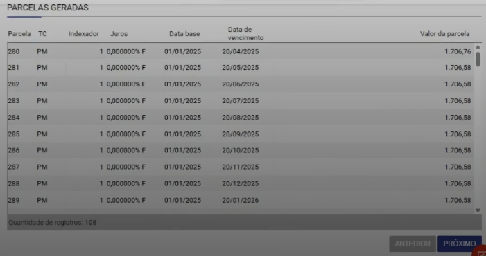

> Tipo de juros\*: Selecionar a opção Nenhum Percentual ao período\*:
> não alterar
>
> Data base para juros: não alterar Clicar em Confirmar
>
> O sistema mostrará a mensagem informando diferença dos valores
> atualizados, em relação aos valores antigos.
>
> O sistema vai mostrar as parcelas do novo parcelamento.

26

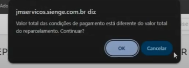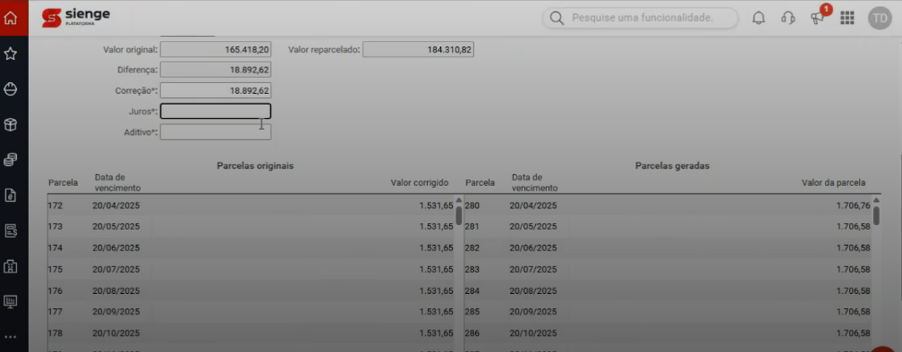

> Clicar em Próximo
>
> Clicar em OK
>
> Replicar em campo Correção o Valor que estiver informado no campo
> Diferença.
>
> “Em alguns reparcelamentos o sistema vai aparecer a seguinte caixa de
> mensagem:
>
> \*O somatório do valor dos campos "correção", "juros" e "aditivo" deve
> ser igual ao valor do campo "diferença".\*
>
> Quando aparecer essa mensagem o valor que está no campo "diferença"
> deve ser repetido no campo "correção", e após poderá clicar em Salvar.
>
> Clicar em Salvar

27

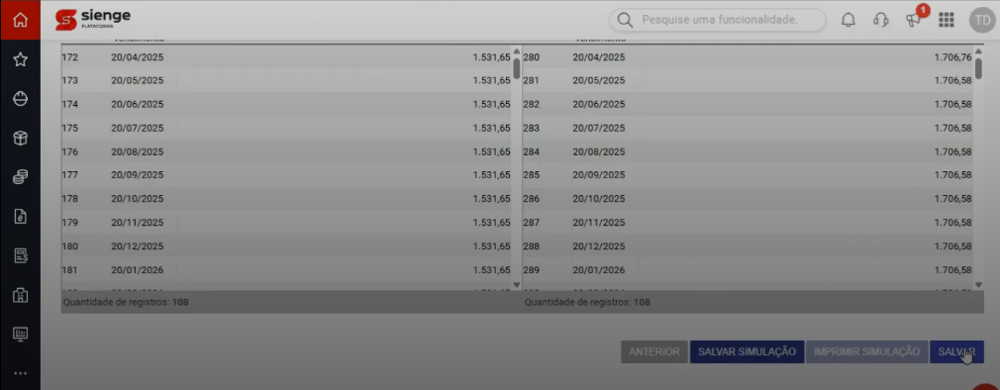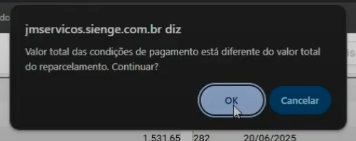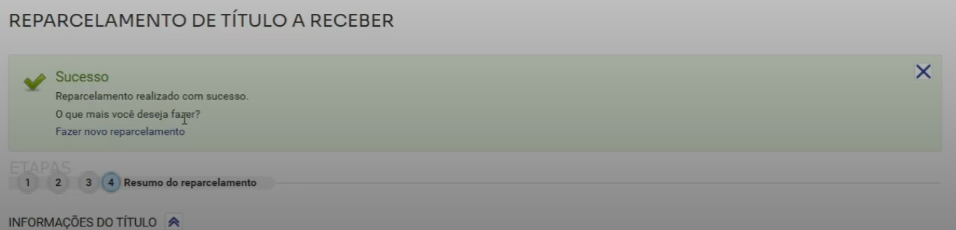

> Mensagem será mostrada novamente, clicar em OK
>
> Na tela aparecerá a confirmação da atualização
>
> Processo de se repete para todos os clientes/títulos que com
> reparcelamento para o mês que foram listados
>
> Quando é finalizada a lista de clientes/títulos o processo seguir para
> a emissão do Carnê

28

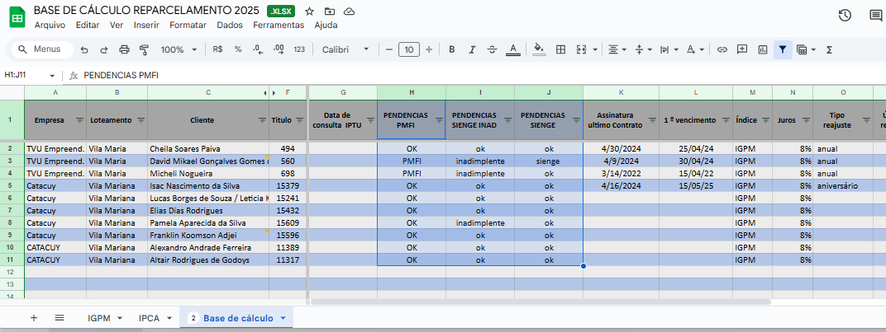

> **10.2** **Emissão** **de** **carnê** **-** **Sistema** **Sienge:**
>
> Por fim, realiza-se a emissão dos boletos atualizados e sua importação
> no Sicredi com acesso e importação sendo feita para cada empresa
>
> Geração de carne é realizada apenas para clientes com status OK nas
> colunas de Pendência
>
> **PENDÊNCIAS** **PMFI** **-**
>
> Caso na 1º etapa do processo tenha sido identificada a pendência de
> atualização de algum cliente/título o robô fará a verificação da
> atualização deste título na planilha de “Base apoio”, acessando a
> mesma e buscando exclusivamente pelo cliente/título que não estava
> atualizado na data da consulta inicial.
>
> Caso ainda conste pendência de consulta, o carnê do mesmo não será
> gerado, e será enviado log ao analista financeiro relatando a
> pendência.
>
> **PENDÊNCIAS** **SIENGE** **INAD** **PENDÊNCIAS** **SIENGE**
>
> Obs: Não gerar carnê caso cliente possua outra situação listada nas
> colunas em questão.
>
> Geração dos boletos através do Sienge.
>
> Para gerar o Carnê retornar para o Sienge Financeiro
>
> Contas a Receber Cobrança Escritural
>
> Geração de Arquivos de remessa

29

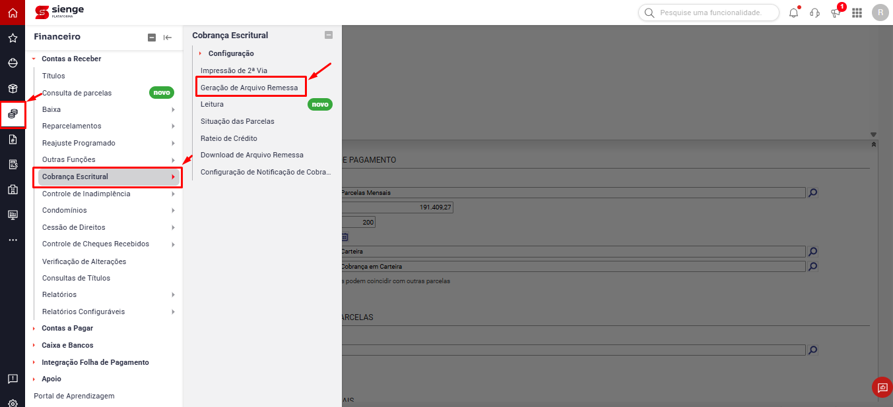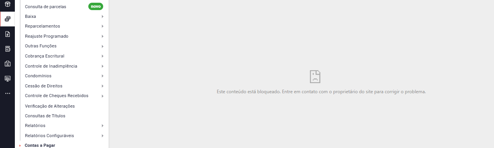

> Solicitada liberação do Acesso para tela Cobrança Escritural - Geração
> de Arquivos de remessa.
>
> Preencher:
>
> Período primeiro dia do próximo mês indicado na coluna
>
> 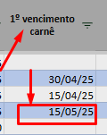Data
> inicial = 1º vencimento carnê (Coluna da planilha) Ex: 15/05/2025
>
> Data final = mesma data do mês anterior no ano seguinte Ex: 15/04/2026

30

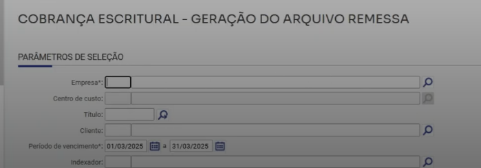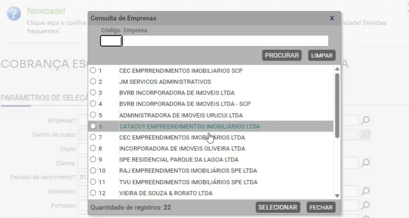

> Nome da empresa - Clicar na Lupa para abrir a lista das unidades
>
> Selecionar a unidade para a qual foi feito o reparcelamento
>
> Fazer o loop emitindo um arquivo de remessa para cada unidade na qual
> houve o reparcelamento de contratos.

31

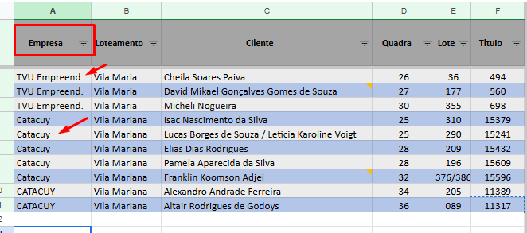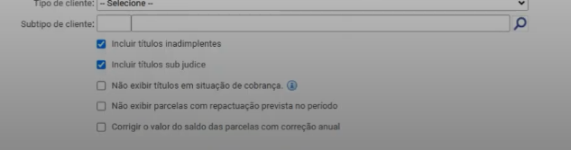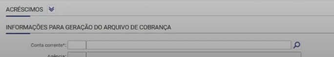

> Marcar opções:
>
> Incluir Títulos Inadimplentes. Incluir Títulos sub judice.
>
> Clicar na lupa na opção Conta Corrente para abrir a caixa de seleção.

32

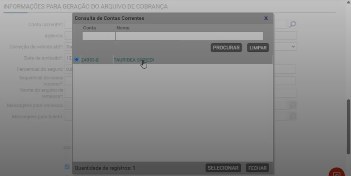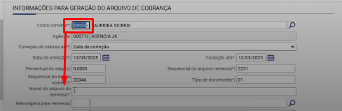

> Selecionar o número da conta da empresa, e clicar em selecionar.
>
> No campo Nome de arquivo de remessa informar:
>
> primeiros 5 dígitos da conta corrente, nº mês, nº dia, (.) e o número
> da sequencial da remessa, todos informados em tela
>
> Ex: do preenchimento (24053312.2231), Registrar no log o n° e a
> unidade empresa a qual corresponde para identificação no momento em
> que for importado o arquivo da empresa no banco.

33

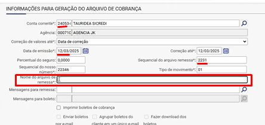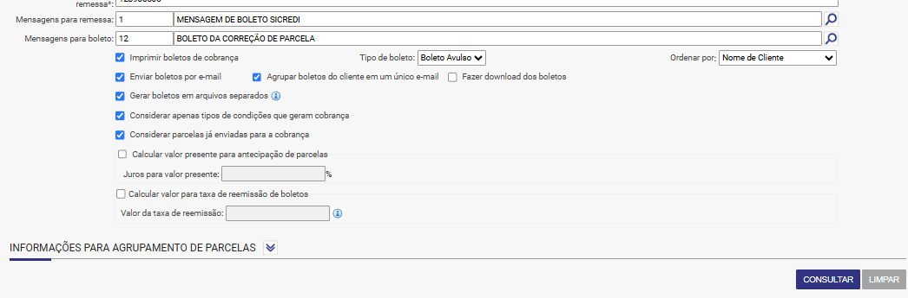

> Nas empresas:
>
> Rio Almada em vez da conta informar os dígito 06300 no início do nome
> do arquivo, demais informações seguem o mesmo padrão
>
> SPE RESIDENCIAL PARQUE DA LAGOA - em vez da conta informar os dígito
> 01870 no início do nome do arquivo, demais informações seguem o mesmo
> padrão
>
> Mensagem para a remessa marcar 1. = Mensagem para Remessa 1 - Mensagem
> de Boleto Sicredi.
>
> Mensagem para Boletos . = Mensagem para boleto 12 - Boleto de Correção
> de Parcel Selecionar opções -Imprimir boletos de cobrança - Enviar
> boletos - Agrupar boletos do cliente
>
> em um único e-mail - Gerar boletos em arquivos separados - Considerar
> apenas os tipos de condições que geram cobrança - Considerar parcelas
> já enviadas para cobrança.
>
> Desmarcar a opção de Fazer Download Clicar em Consultar
>
> Aguardar o carregamento e dar Scroll para visualizar Resultado da
> consulta

34

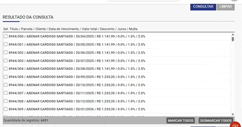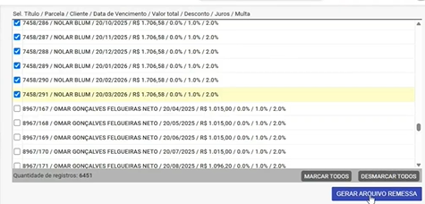

> Identificar na lista os nomes dos clientes adimplentes para quem foi
> realizado o reparcelamento
>
> Selecionar as 12 parcelas geradas para ele no ano Clicar em Gerar
> Arquivo de Remessa
>
> **10.3** **-** **Acesso** **ao** **Banco** **importação** **dos**
> **arquivos** **de** **remessa.**
>
> Seguir para a emissão de boletos no banco : Login e acessos do banco
> detalhados
>
> OBS: É realizado um loop em todos os CNPJs listados para a geração dos
> boletos atualizados de todos os empreendimentos dentro de seu
> respectivo acesso.

35

> Para mudar para o próximo CNPJ/Unidade encerrar a seção do banco e
> abrir novamente o link do banco.
>
> Tabela de CNPJS - Contas JM

||
||
||
||
||
||
||
||
||
||
||
||
||
||
||
||
||
||

> **Passos** **para** **Acesso** **SICREDI**
>
> Acessar a página do banco <u>Sicredi -
> https://www.sicredi.com.br/home/</u>

36

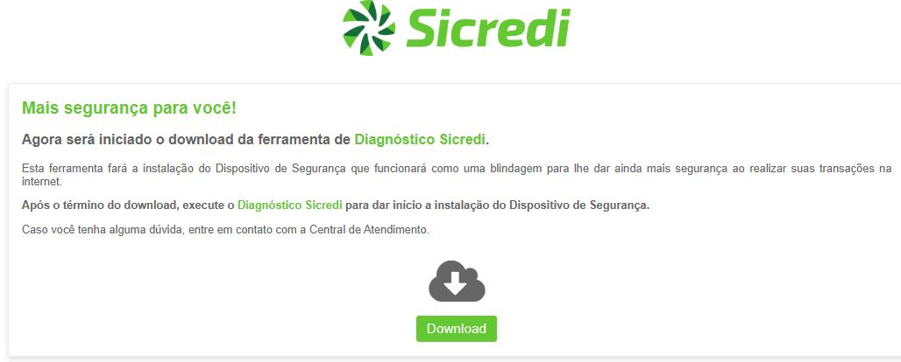

> No primeiro acesso pela máquina é necessária a instalação e execução
> do diagnóstico de segurança do banco.

37

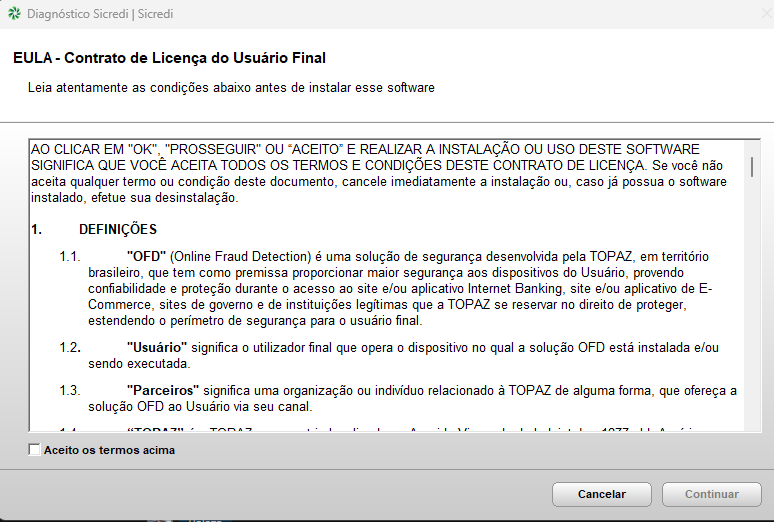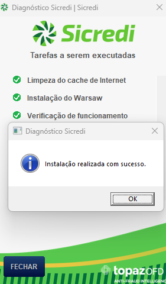

38

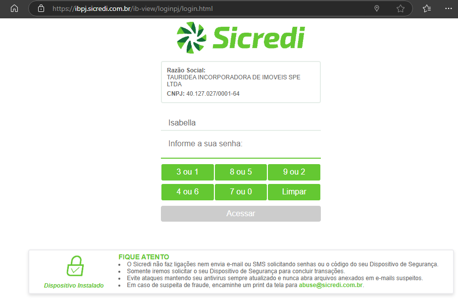

> Após a instalação do módulo de segurança, acessar novamente a página
> do banco <u>Sicredi - https://www.sicredi.com.br/home/</u>
>
> Clicar no botão Acessar minha conta Selecionar a opção Pessoa Jurídica
>
> Preencher o CNPJ da empresa
>
> 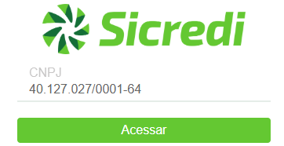 style="width:2.45833in;height:1.26042in" />=\>
>
> Aguardar o carregamento de tela

39

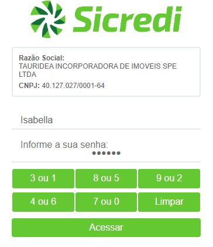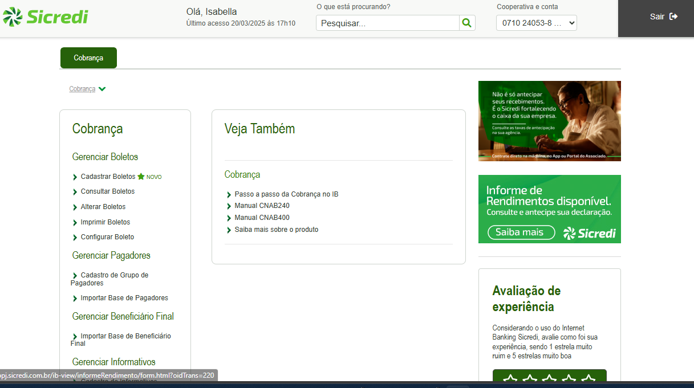

> Informar nome de usuário = Isabella
>
> Digitar senha em teclado virtual. - Disponível em planilha Contas JM
>
> Aguardar o carregamento da tela Inicial da conta
>
> **10.4-** **Importação** **dos** **arquivos** **de** **remessa**
> **por** **Empresa.**
>
> Realizar a importação dos arquivos para o sistema bancário. (SICREDI)
> Clicar na aba cobrança

40

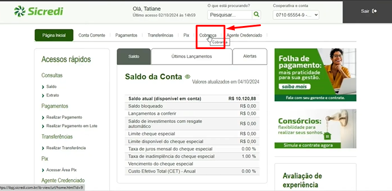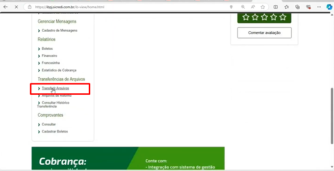

> Dar Scroll para o final da tela para acessar a opção Transferência de
> Arquivos
>
> Clicar em Escolher arquivo

41

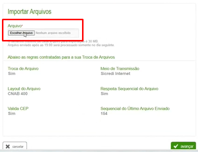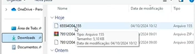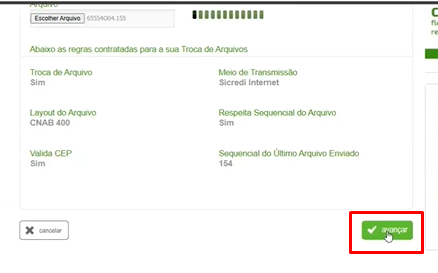

> Selecionar o arquivo gerado no Sienge e subir o mesmo no sistema.
> Atenção ao número que deve ser sequencial ao último exportado.
>
> Este é o número de arquivo registrado no log quando o mesmo foi
> baixado do Sienge - Cada empresa terá seu próprio arquivo para ser
> importado.
>
> Clicar em Avançar
>
> Clicar em Confirmar o envio da remessa

42

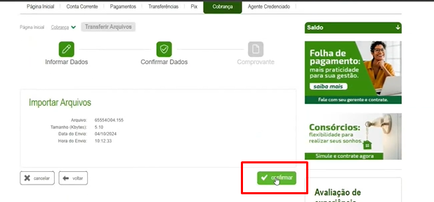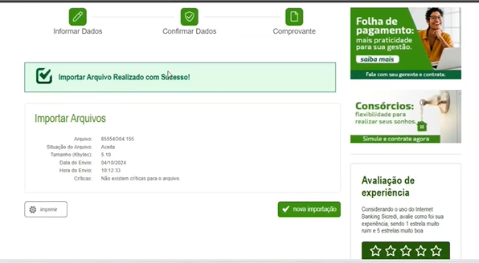

> Repetir o processo de importação de arquivo de remessa para todas as
> empresas que do grupo para as quais os arquivos foram gerados no
> Sienge.

43

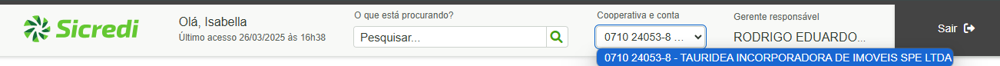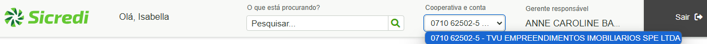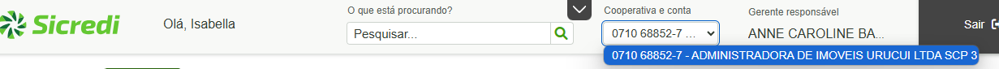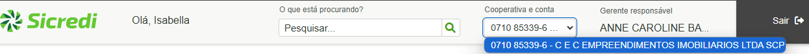

> Validação de acessos bancários por unidade

44

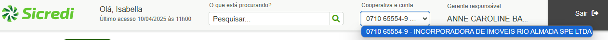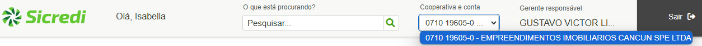

> 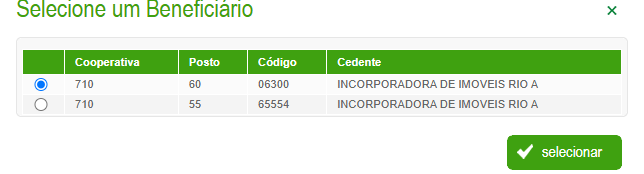 style="width:4.52083in;height:1.21875in" />Rio Almada -\> opção 06300.
>
> **11** **Considerações** **Finais**
>
> Ao final da execução do reparcelamento do mês vigente o robô enviará o
> relatório com o registro da execução e o arquivo correspondente para a
> manutenção do histórico
>
> A padronização e automação deste processo visam melhorar a eficiência,
> reduzir erros operacionais. O controle de exceções e a análise dos
> contratos devem ser conduzidos com rigor para garantir a conformidade
> e evitar retrabalhos.
>
> **12.** **Exceções** **e** **Tratamentos** **de** **Erros**
>
> Situações excepcionais e planos de contingência.
>
> ○ Será realizado o envio de log de erro sempre que o robô:
>
> ■ Identificar divergências de informações
>
> ■ Não encontrar os dados necessários para a execução do processo
> dentro das plataformas ou arquivos utilizados no mesmo
>
> ■ Sofrer alguma quebra

45

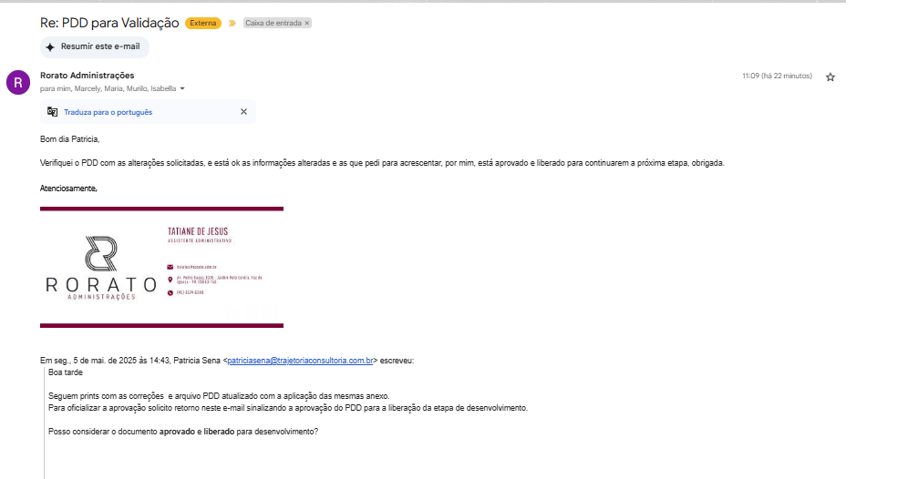

> **13.** **Comunicação** **Centralizada** **em** **Projetos**
>
> ○ Trajetória Consultoria - +55 41 9265-0701 - Grupo de WhatsApp com
> envolvidos nos processos.
>
> **14.** **Registro** **de** **validação** **de** **PDD**
>
> ○ Anexo de retorno de validação.

46
